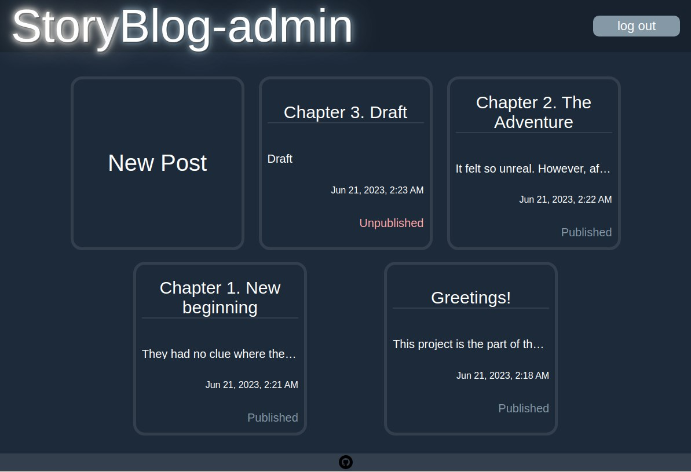
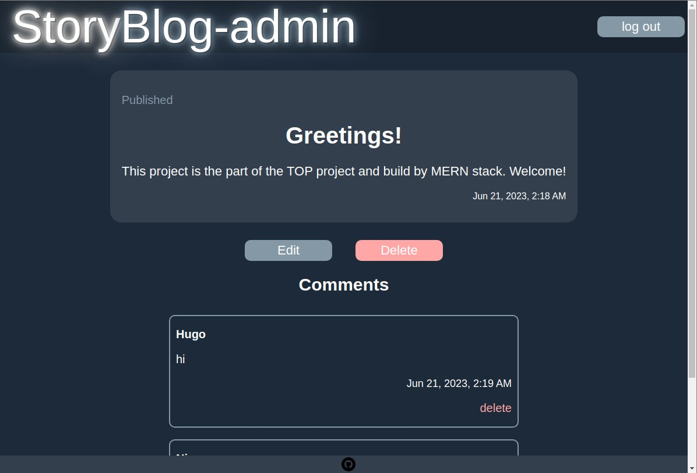
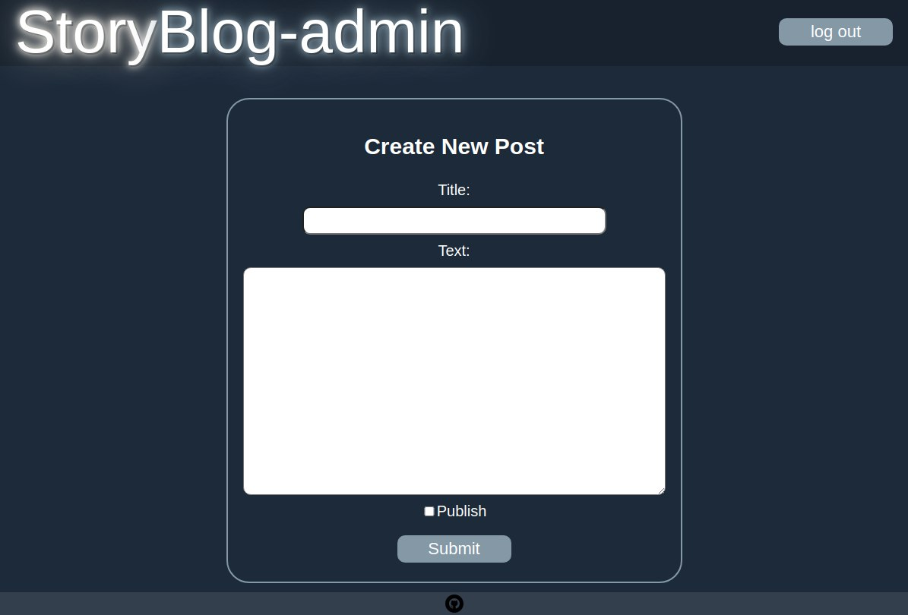
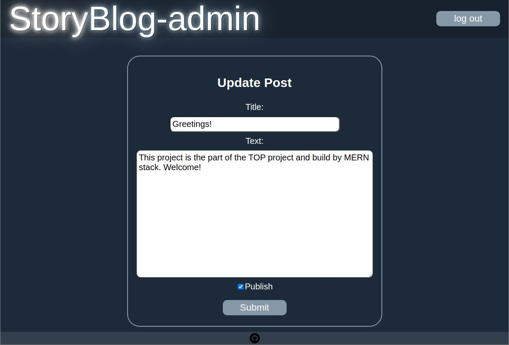

# Blog (admin segment)
To see the website visit [blog](https://blog-admin-zeta.vercel.app/)
## Description
This project is the part of the [TOP project: blog api](https://www.theodinproject.com/lessons/nodejs-blog-api).  
### Other parts
- [blog-api](https://github.com/JuliaShlykova/blog-api)
- [blog-clients](https://github.com/JuliaShlykova/blog-clients)
### Functionality
This part represents frontend for the admin who has the permission to manage the blog:
- create posts,
- delete posts and comments,
- edit posts  
  
  
  

## Technologies used
- React
- React-router-dom
- axios